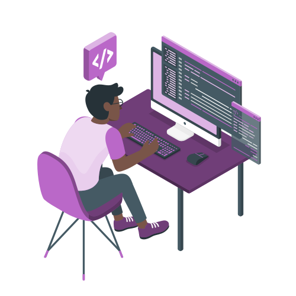

## Olá Mundo! , Eu sou Rener Pires

### Sou Estudante, Desenvolvedor, Tester e Criador!
💻 Você pode achar meus projetos em meu <a href="https://renerpires.com">portfólio</a>

🔧 No momento estou trabalhando em uma ferramenta de automação de testes.

🌱 Atualmente estou aprendendo: Azure DevOps e 

👨🏽‍💻 Estou procurando colaborar com projetos open source

💬 Me pergunte sobre...  Qualquer coisa

😄 Pronomes: Ele/Dele

⚡ Fato Curioso: Tenho um side-project voltado a tradução de um podcast de histórias de terror (Eng -> Pt-Br)

---

<article><h3>Ferramentas de testes:</h3>

<h3>Desenvolvimento:</h3>

<h3>Ferramentas de Design:</h3>

<h3>DevOps:</h3>
	
</article>

---

<h3>Fale comigo:</h3>

