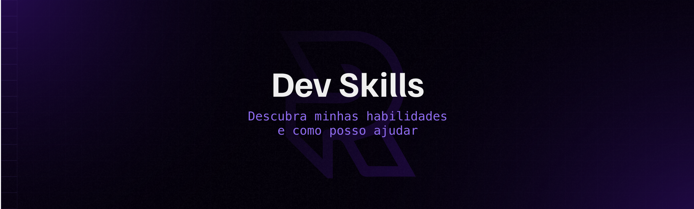

<h2> Olá Mundo! , Eu sou Rener Pires</h2>

 

  

 

💻 Você pode achar meus projetos em meu <a href="https://renerpires.dev">portfólio</a>

🔧 No momento estou trabalhando em uma ferramenta de automação de testes.

🌱 Atualmente estou aprendendo: Azure DevOps

👨🏽‍💻 Estou procurando colaborar com projetos open source

💬 Me pergunte sobre...  Qualquer coisa

😄 Pronomes: Ele/Dele

⚡ Fato Curioso: Tenho um side-project voltado a tradução de um podcast de histórias de terror (Eng -> Pt-Br)

 

---

<h2>Algumas das tecnologias que tenho experiência 👨🏽‍💻</h2>

---

<h2>Me chame para bater um papo:</h2>

---

